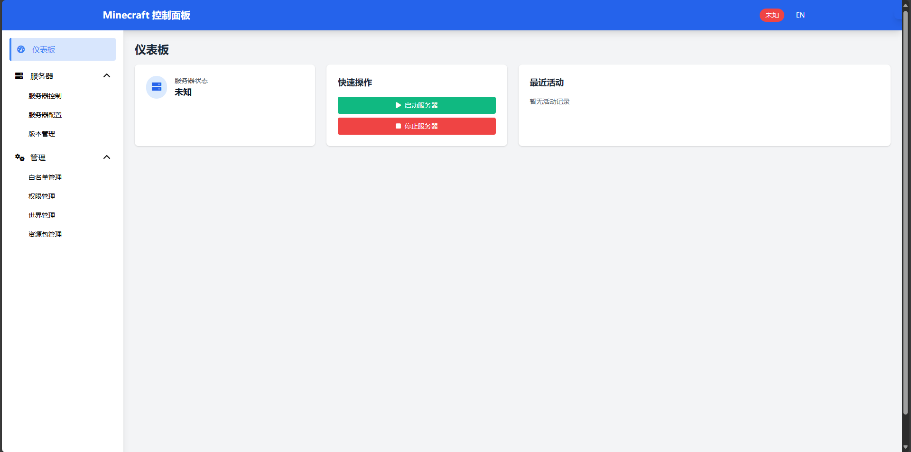
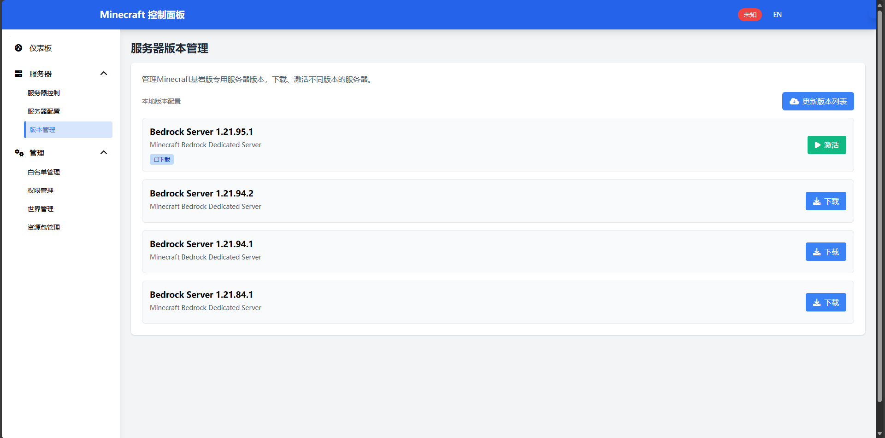

# Minecraft Server Web管理面板

**轻量级** 的 Minecraft 服务器 Web 管理面板，提供现代化的用户界面和完整的服务器管理功能

**目前支持的服务器：**
- ✅Minecraft Bedrock 服务器
- Minecraft Java 服务器

## 🚀 功能特性

### 🌍 Minecraft服务器下载
- **服务器下载** 支持直接从管理页面下载特点版本服务器
- **服务器版本切换** 支持一键切换服务器版本

### 🎮 服务器控制
- **一键启动/停止/重启** Minecraft Bedrock 服务器
- **实时状态监控** 显示服务器运行状态

### ⚙️ 配置管理
- **支持所有主要配置项**：
  - 服务器名称和描述
  - 游戏模式（生存/创造/冒险）
  - 难度设置（和平/简单/普通/困难）
  - 最大玩家数量
  - 服务器端口配置
  - 作弊和白名单开关
- **服务器配置文件管理** 自动维护 `server.properties` 文件

### 👥 白名单管理
- **添加/删除玩家** 管理允许加入服务器的玩家列表
- **白名单文件管理** 自动维护 `allowlist.json` 文件

### 🛡️ 权限管理
- **三级权限系统**：
  - **访客 (Visitor)** - 基础游戏权限
  - **成员 (Member)** - 标准玩家权限
  - **管理员 (Operator)** - 完整管理权限
- **玩家权限设置** 为特定玩家分配权限级别
- **权限文件管理** 自动维护 `permissions.json` 文件

### 🌍 世界管理
- **世界文件上传** 支持 `.zip` 和 `.mcworld` 格式
- **世界切换** 一键激活不同的世界
- **世界删除** 安全删除不需要的世界文件
- **当前世界标识** 清晰显示正在使用的世界

### 🌍 资源包管理
- **资源文件上传** 支持 `.zip` 和 `.mcpack` 格式
- **资源激活** 一键激活不同的资源包
- **资源删除** 安全删除不需要的资源包

## 👀 管理端预览



## 📋 系统要求

### 服务器环境
- **操作系统**: Windows 10+ 或 Ubuntu 18.04+ (Linux)
- **内存**: 至少 2GB RAM
- **存储**: 至少 10GB 可用空间
- **网络**: 开放端口 8081（管理面板）和 19132（Minecraft 服务器）

## 🛠️ 安装指南

### 快速开始（推荐）

1. **下载预编译版本**：
   - 从 [Releases](https://github.com/ckfanzhe/bedrock-easy-server/releases) 页面下载适合您操作系统的版本
   - `minecraft-server-manager-windows.exe` 适用于 Windows
   - `minecraft-server-manager-linux` 适用于 Linux


2. **运行应用程序**：
   ```bash
   # Linux 系统
   chmod +x minecraft-server-manager-linux
   ./minecraft-server-manager-linux
   
   # Windows 系统
   minecraft-server-manager-windows.exe
   ```

### 从源码构建（开发者）

1. **前置要求**: Go 1.21 或更高版本
2. **克隆仓库**：
   ```bash
   git clone https://github.com/ckfanzhe/bedrock-easy-server.git
   cd minecraft-easy-server
   ```
3. **构建所有平台版本**：
   ```bash
   chmod +x build.sh
   ./build.sh
   ```
4. **或构建单一平台**：
   ```bash
   go build -o minecraft-server-manager
   ```

## 🚀 使用指南

### 启动管理面板

1. **运行应用程序**：
   ```bash
   # Linux 系统
   ./minecraft-server-manager-linux
   
   # Windows 系统
   minecraft-server-manager-windows.exe
   ```

2. **访问管理界面**：
   - 打开浏览器访问：`http://localhost:8081`
   - 管理面板将自动加载

### 防火墙配置
确保以下端口在防火墙中开放：
- **8081**: 管理面板访问端口
- **19132**: Minecraft Bedrock 服务器默认端口
- **19133**: Minecraft Bedrock 服务器 IPv6 端口

## 其他

### TODO计划功能
- ✅ 支持一键导入mcpackage模组
- ✅ 支持Linux操作系统
- 🔄 bedrock服务器日志实时查看
- 🔄 直接通过页面执行命令到Bedrock服务器
- 🔄 玩家在线状态监控
- 🔄 服务器性能监控
- 🔄 世界自动备份功能
- ✅ 多语言界面支持
- 🔄 Java服务器支持 - 支持Minecraft Java Edition服务器
- 🔄 Docker支持 - 容器化部署支持

## 🤝 贡献指南

欢迎提交问题报告、功能建议和代码贡献！

### 开发环境设置
1. Fork 项目仓库
2. 创建功能分支：`git checkout -b feature/new-feature`
3. 提交更改：`git commit -am 'Add new feature'`
4. 推送分支：`git push origin feature/new-feature`
5. 创建 Pull Request

### 代码规范
- 使用 Go 标准代码格式
- 添加适当的注释和文档
- 确保代码通过测试
- 遵循项目的架构模式

## 📄 许可证

本项目采用 MIT 许可证 - 查看 [LICENSE](LICENSE) 文件了解详情。

## 🙏 致谢

- [Gin Web Framework](https://gin-gonic.com/) - 高性能的 Go Web 框架
- [Tailwind CSS](https://tailwindcss.com/) - 实用优先的 CSS 框架
- [Font Awesome](https://fontawesome.com/) - 图标库
- [Minecraft Bedrock](https://www.minecraft.net/) - 游戏服务器
