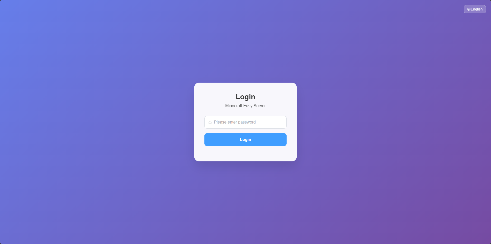
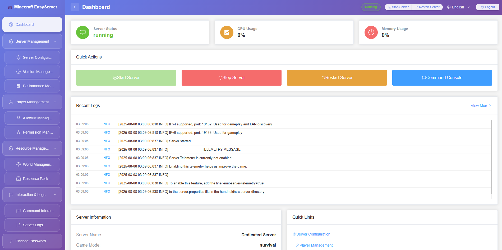
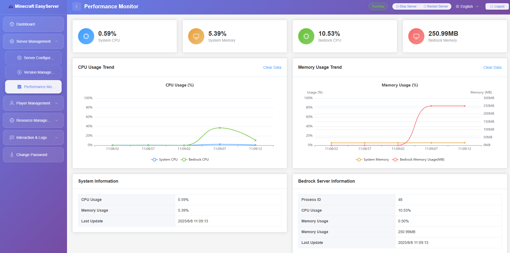
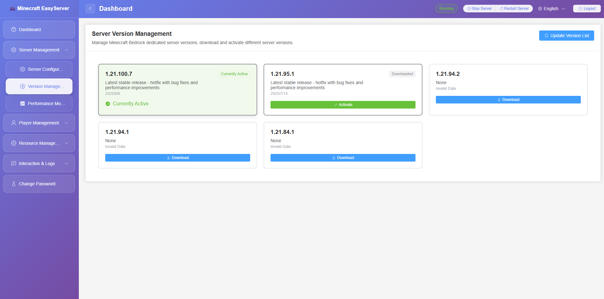
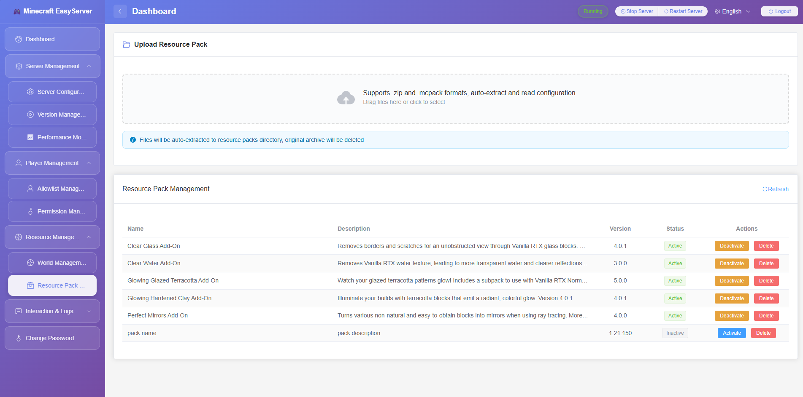
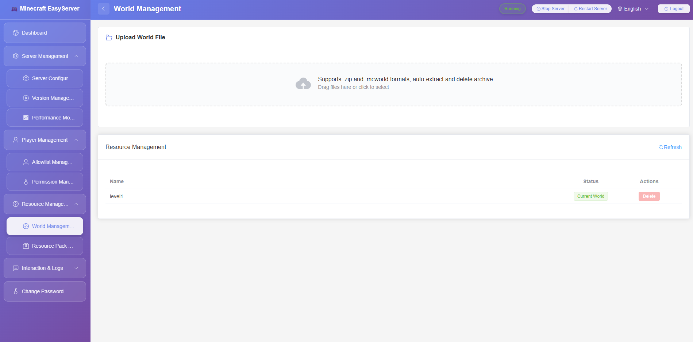
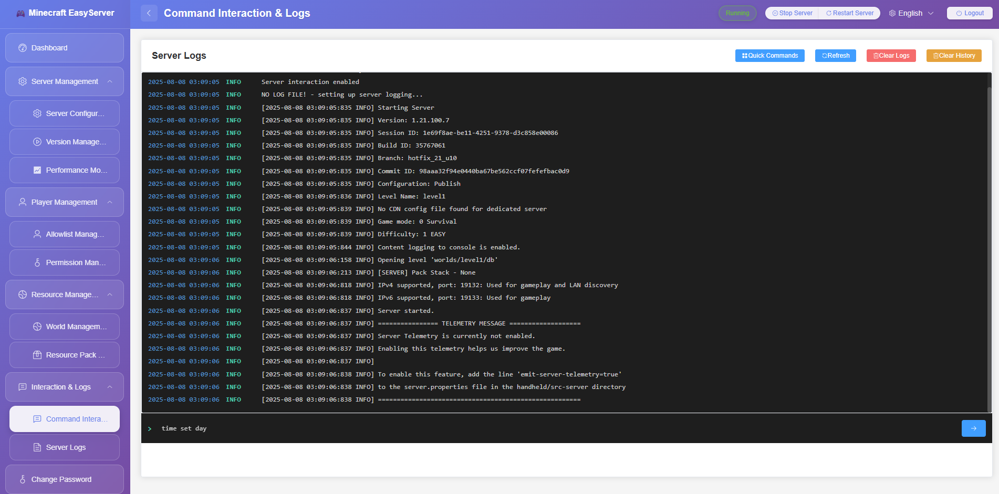
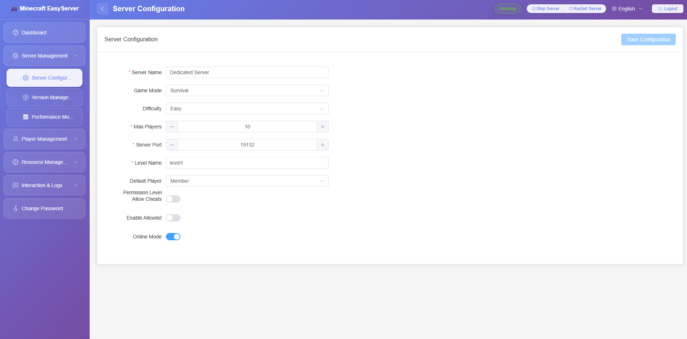

<div align="right">
  <details>
    <summary >🌐 Language</summary>
    <div>
      <div align="center">
        <a href="https://openaitx.github.io/view.html?user=ckfanzhe&project=minecraft-easyserver&lang=en">English</a>
        | <a href="https://openaitx.github.io/view.html?user=ckfanzhe&project=minecraft-easyserver&lang=zh-CN">简体中文</a>
        | <a href="https://openaitx.github.io/view.html?user=ckfanzhe&project=minecraft-easyserver&lang=zh-TW">繁體中文</a>
        | <a href="https://openaitx.github.io/view.html?user=ckfanzhe&project=minecraft-easyserver&lang=ja">日本語</a>
        | <a href="https://openaitx.github.io/view.html?user=ckfanzhe&project=minecraft-easyserver&lang=ko">한국어</a>
        | <a href="https://openaitx.github.io/view.html?user=ckfanzhe&project=minecraft-easyserver&lang=hi">हिन्दी</a>
        | <a href="https://openaitx.github.io/view.html?user=ckfanzhe&project=minecraft-easyserver&lang=th">ไทย</a>
        | <a href="https://openaitx.github.io/view.html?user=ckfanzhe&project=minecraft-easyserver&lang=fr">Français</a>
        | <a href="https://openaitx.github.io/view.html?user=ckfanzhe&project=minecraft-easyserver&lang=de">Deutsch</a>
        | <a href="https://openaitx.github.io/view.html?user=ckfanzhe&project=minecraft-easyserver&lang=es">Español</a>
        | <a href="https://openaitx.github.io/view.html?user=ckfanzhe&project=minecraft-easyserver&lang=it">Italiano</a>
        | <a href="https://openaitx.github.io/view.html?user=ckfanzhe&project=minecraft-easyserver&lang=ru">Русский</a>
        | <a href="https://openaitx.github.io/view.html?user=ckfanzhe&project=minecraft-easyserver&lang=pt">Português</a>
        | <a href="https://openaitx.github.io/view.html?user=ckfanzhe&project=minecraft-easyserver&lang=nl">Nederlands</a>
        | <a href="https://openaitx.github.io/view.html?user=ckfanzhe&project=minecraft-easyserver&lang=pl">Polski</a>
        | <a href="https://openaitx.github.io/view.html?user=ckfanzhe&project=minecraft-easyserver&lang=ar">العربية</a>
        | <a href="https://openaitx.github.io/view.html?user=ckfanzhe&project=minecraft-easyserver&lang=fa">فارسی</a>
        | <a href="https://openaitx.github.io/view.html?user=ckfanzhe&project=minecraft-easyserver&lang=tr">Türkçe</a>
        | <a href="https://openaitx.github.io/view.html?user=ckfanzhe&project=minecraft-easyserver&lang=vi">Tiếng Việt</a>
        | <a href="https://openaitx.github.io/view.html?user=ckfanzhe&project=minecraft-easyserver&lang=id">Bahasa Indonesia</a>
        | <a href="https://openaitx.github.io/view.html?user=ckfanzhe&project=minecraft-easyserver&lang=as">অসমীয়া</
      </div>
    </div>
  </details>
</div>

# Minecraft Server Web Management Panel

**[中文版本 (Chinese Version)](docs/README_CN.md)**

A **lightweight** Minecraft server web management panel with modern UI and comprehensive server management features.

**Currently Supported Servers:**
- ✅ Minecraft Bedrock Server
- Minecraft Java Server

## 🚀 Features

### 🌍 Minecraft Server Download
- **Server Download** Support for downloading specific server versions directly from the management page
- **Server Version Switching** Support for one-click server version switching

### 🎮 Server Control
- **One-click Start/Stop/Restart** Minecraft Bedrock server
- **Real-time Status Monitoring** Display server running status

### ⚙️ Configuration Management
- **Support for all major configuration options**:
  - Server name and description
  - Game mode (Survival/Creative/Adventure)
  - Difficulty settings (Peaceful/Easy/Normal/Hard)
  - Maximum player count
  - Server port configuration
  - Cheats and whitelist toggles
- **Server Configuration File Management** Automatically maintains `server.properties` file

### 👥 Whitelist Management
- **Add/Remove Players** Manage the list of players allowed to join the server
- **Whitelist File Management** Automatically maintains `allowlist.json` file

### 🛡️ Permission Management
- **Three-tier Permission System**:
  - **Visitor** - Basic game permissions
  - **Member** - Standard player permissions
  - **Operator** - Full administrative permissions
- **Player Permission Settings** Assign permission levels to specific players
- **Permission File Management** Automatically maintains `permissions.json` file

### 🌍 World Management
- **World File Upload** Support for `.zip` and `.mcworld` formats with automatic extraction
- **World Switching** One-click activation of different worlds
- **World Deletion** Safe deletion of unwanted world files
- **Current World Identification** Clear display of the currently active world

### 🌍 Resource Pack Management
- **Resource File Upload** Support for `.zip` and `.mcpack` formats
- **Resource Activation** One-click activation of different resource packs
- **Resource Deletion** Safe deletion of unwanted resource packs

### 📋 Server Logs
- **Real-time Log Viewing** Monitor Minecraft server logs in real-time through the web interface
- **Auto-scroll** Option to automatically scroll to the latest log entries

### 💻 Command Execution
- **Direct Command Input** Execute Minecraft server commands directly from the web interface
- **Command History** View and reuse previously executed commands
- **Quick Commands** Access frequently used commands through categorized quick access buttons

### 🔐 Authentication & Security
- **Login System** Secure access to the management panel with password authentication
- **Session Management** Automatic session handling with secure token-based authentication
- **Access Control** Protect server management functions from unauthorized access


## 📋 System Requirements

### Server Environment
- **Operating System**: Windows 10+ or Ubuntu 18.04+ (Linux)
- **Memory**: At least 2GB RAM
- **Storage**: At least 10GB available space
- **Network**: Open ports 8080 (management panel) and 19132 (Minecraft server)

## 🛠️ Installation Guide

### Quick Start (Recommended)

1. **Download Pre-built Release**:
   - Download the appropriate version for your operating system from the [Releases](https://github.com/ckfanzhe/bedrock-easy-server/releases) page
   - `minecraft-server-manager-windows.exe` for Windows
   - `minecraft-server-manager-linux` for Linux

2. **Run the Application**:
   ```bash
   # For Linux
   chmod +x minecraft-server-manager-linux
   ./minecraft-server-manager-linux
   
   # For Windows
   minecraft-server-manager-windows.exe
   ```

### Docker Deployment

1. **Using Docker directly (Recommended)**:
   ```bash
   # Create data directory for persistent storage
   mkdir -p data
   
   # Run the container using the published image
   docker run -d \
     --name minecraft-easyserver \
     -p 8080:8080 \
     -p 19132:19132/udp \
     -p 19133:19133/udp \
     -v ./data:/data/bedrock-server \
     -v ./config:/data/config \
     ifanzhe/minecraft-easyserver:latest
   ```

2. **Using Docker Compose**:
   ```bash
   # Create docker-compose.yml file
   cat > docker-compose.yml << EOF
   version: '3.8'
   services:
     minecraft-server-manager:
       image: ifanzhe/minecraft-easyserver:latest
       container_name: minecraft-easyserver
       ports:
         - "8080:8080"
         - "19132:19132/udp"
         - "19133:19133/udp"
       volumes:
         - ./data:/data/bedrock-server
         - ./config:/data/config
       environment:
         - TZ=Asia/Shanghai
       restart: unless-stopped
       healthcheck:
         test: ["CMD", "curl", "-f", "http://localhost:8080"]
         interval: 30s
         timeout: 10s
         retries: 3
   EOF
   
   # Start with Docker Compose
   docker-compose up -d
   ```

3. **Access the application**:
   - Open browser and visit: `http://localhost:8080`
   - Server data will be persisted in the `./data` directory

### Build from Source (For Developers)

1. **Prerequisites**: 
   - Go 1.21 or higher
   - Node.js 16+ and npm (for frontend compilation)

2. **Clone Repository**:
   ```bash
   git clone https://github.com/ckfanzhe/bedrock-easy-server.git
   cd minecraft-easy-server
   ```

3. **Build All Platforms (Recommended)**:
   ```bash
   chmod +x build.sh
   ./build.sh
   ```
   This script will:
   - Install frontend dependencies (`npm install`)
   - Build the Vue.js frontend (`npm run build`)
   - Copy built assets to the embed directory
   - Compile Go binaries for all platforms with embedded frontend

4. **Manual Build Steps** (if you prefer step-by-step):
   ```bash
   # Build frontend first
   cd minecraft-easyserver-web
   npm install
   npm run build
   cd ..
   
   # Copy frontend build output
   rm -rf web/*
   cp -r minecraft-easyserver-web/dist/* web/
   
   # Build Go binary
   go build -o minecraft-server-manager
   ```

**Note**: The build process now includes frontend compilation using webpack, which bundles all Vue.js components, styles, and assets into optimized files that are then embedded into the Go binary for single-file deployment.

## 🚀 Usage Guide

### Start Management Panel

1. **Run the Application**:
   ```bash
   # For Linux
   ./minecraft-server-manager-linux
   
   # For Windows double-click to run
   minecraft-server-manager-windows.exe
   ```

2. **Access Management Interface**:
   - Open browser and visit: `http://localhost:8080`
   - The management panel will load automatically

## 🔥 Firewall Configuration

### Windows Firewall
On some systems, when you wish to connect to the server using a client running on the same machine as the server is running on, you will need to exempt the Minecraft client from UWP loopback restrictions:

```powershell
CheckNetIsolation.exe LoopbackExempt -a -p=S-1-15-2-1958404141-86561845-1752920682-3514627264-368642714-62675701-733520436
```

Ensure the following ports are open in the firewall:
- **8080**: Management panel access port
- **19132**: Minecraft Bedrock server default port
- **19133**: Minecraft Bedrock server IPv6 port

## 📝 Additional Information

### TODO Planned Features
- ✅ Support for one-click mcpackage mod import
- ✅ Linux operating system support
- ✅ Real-time Bedrock server log viewing
- ✅ Direct command execution to Bedrock server through web interface
- 🔄 Player online status monitoring
- ✅ Server performance monitoring
- 🔄 Automatic world backup functionality
- ✅ Multi-language interface support
- 🔄 Java Server Support - Support for Minecraft Java Edition servers
- ✅ Docker Support - Containerized deployment support

## 🤝 Contributing

Welcome to submit issue reports, feature suggestions, and code contributions!

### Development Environment Setup
1. Fork the project repository
2. Create a feature branch: `git checkout -b feature/new-feature`
3. Commit changes: `git commit -am 'Add new feature'`
4. Push branch: `git push origin feature/new-feature`
5. Create Pull Request

### Code Standards
- Use Go standard code formatting
- Add appropriate comments and documentation
- Ensure code passes tests
- Follow the project's architectural patterns

## 📄 License

This project is licensed under the MIT License - see the [LICENSE](LICENSE) file for details.

## 🙏 Acknowledgments

- [Gin Web Framework](https://gin-gonic.com/) - High-performance Go web framework
- [Tailwind CSS](https://tailwindcss.com/) - Utility-first CSS framework
- [Font Awesome](https://fontawesome.com/) - Icon library
- [Minecraft Bedrock](https://www.minecraft.net/) - Game server

## 👀 Management Panel Preview
> Screenshots of some features, more features are welcome to be experienced in person.









