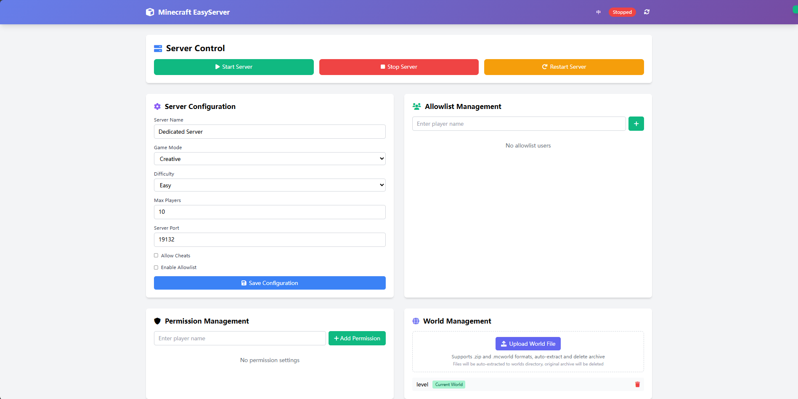

# Minecraft Server Web Management Panel

**[中文版本 (Chinese Version)](docs/README_CN.md)**

A **lightweight** Minecraft server web management panel with modern UI and comprehensive server management features.

**Currently Supported Platforms:**
- ✅ Windows
- Linux
- macOS

**Currently Supported Servers:**
- ✅ Minecraft Bedrock Server
- Minecraft Java Server

## 🚀 Features

### 🎮 Server Control
- **One-click Start/Stop/Restart** Minecraft Bedrock server
- **Real-time Status Monitoring** Display server running status

### ⚙️ Configuration Management
- **Support for all major configuration options**:
  - Server name and description
  - Game mode (Survival/Creative/Adventure)
  - Difficulty settings (Peaceful/Easy/Normal/Hard)
  - Maximum player count
  - Server port configuration
  - Cheats and whitelist toggles
- **Server Configuration File Management** Automatically maintains `server.properties` file

### 👥 Whitelist Management
- **Add/Remove Players** Manage the list of players allowed to join the server
- **Whitelist File Management** Automatically maintains `allowlist.json` file

### 🛡️ Permission Management
- **Three-tier Permission System**:
  - **Visitor** - Basic game permissions
  - **Member** - Standard player permissions
  - **Operator** - Full administrative permissions
- **Player Permission Settings** Assign permission levels to specific players
- **Permission File Management** Automatically maintains `permissions.json` file

### 🌍 World Management
- **World File Upload** Support for `.zip` and `.mcworld` formats with automatic extraction
- **World Switching** One-click activation of different worlds
- **World Deletion** Safe deletion of unwanted world files
- **Current World Identification** Clear display of the currently active world

### 🌍 Resource Pack Management
- **Resource File Upload** Support for `.zip` and `.mcpack` formats
- **Resource Activation** One-click activation of different resource packs
- **Resource Deletion** Safe deletion of unwanted resource packs

## 👀 Management Panel Preview


## 📋 System Requirements

### Server Environment (Windows)
- **Operating System**: Windows 10 or higher
- **Go Language**: 1.21 or higher
- **Memory**: At least 2GB RAM
- **Storage**: At least 10GB available space
- **Network**: Open ports 8080 (management panel) and 19132 (Minecraft server)

### Minecraft Bedrock Server
- Downloaded and extracted Minecraft Bedrock Dedicated Server
- Server files should be placed in `./bedrock-server/bedrock-server-1.21.95.1/` directory

## 🛠️ Installation Guide

### 1. Environment Setup

#### Install Go Language
1. Visit [Go Official Website](https://golang.org/dl/) to download Windows version
2. Run the installer and follow the prompts to complete installation
3. Verify installation:
   ```powershell
   go version
   ```

#### Download Minecraft Bedrock Server
1. Visit [Minecraft Official Website](https://www.minecraft.net/en-us/download/server/bedrock)
2. Download Bedrock Dedicated Server
3. Extract to the `bedrock-server` folder in the project directory

### 2. Project Deployment

#### Clone or Download Project
```powershell
# If using Git
git clone https://github.com/ckfanzhe/bedrock-easy-server.git
cd bedrock-easyserver

# Or download and extract project files directly
```

#### Install Dependencies
```powershell
go mod tidy
```

#### Build Project
```powershell
# Build executable file
go build -o bedrock-easyserver.exe

# Or run directly
go run main.go
```

### 3. Directory Structure Confirmation

Ensure your project directory structure is as follows:
```
bedrock-easyserver/
├── main.go                    # Main program file
├── go.mod                     # Go module file
├── go.sum                     # Go dependency verification file
├── config.yml                 # Application configuration file
├── README.md                  # Project documentation (English)
├── README_CN.md               # Project documentation (Chinese)
├── .gitignore                 # Git ignore file configuration
├── config/                    # Configuration module
│   └── config.go             # Configuration processing logic
├── handlers/                  # HTTP handlers
│   ├── handlers.go           # API route handling
│   └── handlers_test.go      # Handler unit tests
├── models/                    # Data models
│   └── models.go             # Data structure definitions
├── services/                  # Business logic services
│   ├── services.go           # Core business logic
│   └── services_test.go      # Service layer unit tests
├── web/                       # Frontend files
│   ├── index.html            # Main page
│   └── app.js                # JavaScript logic
└── bedrock-server/           # Bedrock server directory
    └── bedrock-server-1.21.95.1/
        ├── bedrock_server.exe
        ├── server.properties
        ├── allowlist.json
        ├── permissions.json
        └── worlds/
```

## 🚀 Usage Guide

### Start Management Panel

1. **Command Line Startup**:
   ```powershell
   # Method 1: Run source code directly
   go run main.go
   
   # Method 2: Run compiled program
   ./bedrock-easyserver.exe
   ```

2. **Access Management Interface**:
   - Open browser and visit: `http://localhost:8080`
   - The management panel will load automatically

### Firewall Configuration
Ensure the following ports are open in the firewall:
- **8080**: Management panel access port
- **19132**: Minecraft Bedrock server default port
- **19133**: Minecraft Bedrock server IPv6 port

## 📝 Additional Information

### TODO Planned Features
- 🔄 Support for one-click mcpackage mod import
- 🔄 Linux operating system support
- 🔄 Real-time Bedrock server log viewing
- 🔄 Direct command execution to Bedrock server through web interface
- 🔄 Player online status monitoring
- 🔄 Server performance monitoring
- 🔄 Automatic world backup functionality
- 🔄 Multi-language interface support

## 🤝 Contributing

Welcome to submit issue reports, feature suggestions, and code contributions!

### Development Environment Setup
1. Fork the project repository
2. Create a feature branch: `git checkout -b feature/new-feature`
3. Commit changes: `git commit -am 'Add new feature'`
4. Push branch: `git push origin feature/new-feature`
5. Create Pull Request

### Code Standards
- Use Go standard code formatting
- Add appropriate comments and documentation
- Ensure code passes tests
- Follow the project's architectural patterns

## 📄 License

This project is licensed under the MIT License - see the [LICENSE](LICENSE) file for details.

## 🙏 Acknowledgments

- [Gin Web Framework](https://gin-gonic.com/) - High-performance Go web framework
- [Tailwind CSS](https://tailwindcss.com/) - Utility-first CSS framework
- [Font Awesome](https://fontawesome.com/) - Icon library
- [Minecraft Bedrock](https://www.minecraft.net/) - Game server